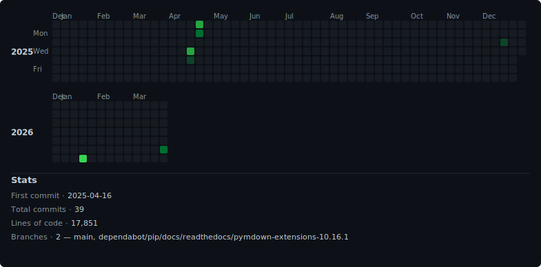

# DMARQ




**DMARQ** is a modern, privacy-conscious DMARC monitoring and analysis platform built for professionals who want deep visibility into their email authentication posture — without giving up control or relying on third-party SaaS providers.

🌐 [Live Demo (soon)](https://app.dmarq.org)  
🔒 Self-hosted. Secure. Beautifully visual.  
🛠️ Docker-deployable. Cloudflare-integrated.  
📬 Aggregate & forensic report support.

---

## 💡 What is DMARQ?

DMARQ ingests and visualizes DMARC (Domain-based Message Authentication, Reporting & Conformance) reports — both aggregate and forensic — to help domain owners understand who is sending emails on their behalf and whether those messages are properly authenticated using SPF and DKIM.

No more guessing. See which services are passing DMARC, which are failing, and how to fix them — all in one clear dashboard.

---

## 🚀 Current Status - Milestone 1 Completed

We have achieved **Milestone 1: Basic DMARC Monitoring**. This milestone includes:

- ✅ DMARC XML report parsing (supports XML, ZIP, and GZIP formats)
- ✅ In-memory storage of report data for up to 5 domains
- ✅ Simple dashboard UI showing DMARC compliance statistics
- ✅ Support for uploading and processing DMARC aggregate reports
- ✅ Domain overview with compliance rates and email statistics

You can now:
1. Upload DMARC aggregate reports via the web interface
2. View summary statistics across all monitored domains
3. Drill down into domain-specific details and reports
4. Track compliance rates and authentication failures

---

## ✨ Key Features

### 📊 Dashboard & Reports
- **DMARC Compliance Rate**: Track pass/fail rates over time
- **Enforcement Rate**: Visualize policy strength and adoption
- **Volume & Trends**: Identify traffic spikes and anomalies
- **Top Sending Sources**: Detect unknown or unauthorized senders
- **Forensic Reports**: Analyze failure samples (RFC 6591 support)

### 🛡 DNS Record Health
- Inspect **SPF**, **DKIM**, **DMARC**, **MX**, and **BIMI** records
- Show which records are missing, broken, or invalid
- Get **fix suggestions** tailored to your provider (e.g., Google, Microsoft)
- 🔒 No automatic changes — all DNS updates require explicit confirmation

### 🌐 Cloudflare Integration
- Automatically discover domains in your Cloudflare account
- Fetch and analyze relevant DNS records
- Suggest missing or malformed entries
- Track configuration changes over time (coming soon)

### ⚙️ Web-Based Setup Wizard
- Guided onboarding experience (no CLI setup required)
- Store all configuration in a secure internal database
- Seed config with environment variables for headless deployment

### 🚨 Alerts & Notifications
- Integration with [Apprise](https://github.com/caronc/apprise)
- Email, Slack, webhook, and more
- Alert on new failures, compliance drops, or unknown senders

### 🔐 User Management
- Built-in authentication via **FastAPI Users**
- JWT-secured API endpoints
- Admin dashboard access control

---

## 🚀 Getting Started

You can deploy DMARQ in minutes using Docker Compose:

```bash
git clone https://github.com/YOUR_USERNAME/dmarq.git
cd dmarq
cp .env.example .env
docker compose up --build
```

Then visit [http://localhost](http://localhost) to access the dashboard and upload your DMARC reports.

### Development Setup

For development without Docker:

```bash
cd backend
pip install -r requirements.txt
uvicorn app.main:app --reload --port 8080
```

Then visit [http://localhost:8080](http://localhost:8080)

---

## 📦 Requirements

- DMARC aggregate reports (XML, ZIP, or GZIP format)
- Docker + Docker Compose (for production deployment)
- Python 3.10+ (for development)

---

## 🧪 Development Roadmap

- ✅ **Milestone 1**: Basic DMARC Monitoring (up to 5 domains)
- 🔄 **Milestone 2**: Enhanced Visualization & Analysis
- 🔜 **Milestone 3**: Database Persistence & User Management
- 🔜 **Milestone 4**: Email Integration & Automated Processing
- 🔜 **Milestone 5**: DNS Health & Configuration Suggestions

---

## 📘 License

MIT License — you are free to use, modify, and host DMARQ for any purpose.

---

## 🤝 Contributing

Pull requests are welcome! Please open an issue to discuss major features or design ideas before submitting code. Full contributing guide coming soon.

---

## 🛡 Why DMARQ?

Unlike most commercial DMARC tools, DMARQ gives you:
- 🔍 Full visibility without third-party access to your reports
- 🧠 Intelligence-driven suggestions, not just raw data
- 🎨 A beautiful, intuitive dashboard with real-time insights
- 💻 Self-hosted flexibility with modern developer practices

Let's build better email security — together.
